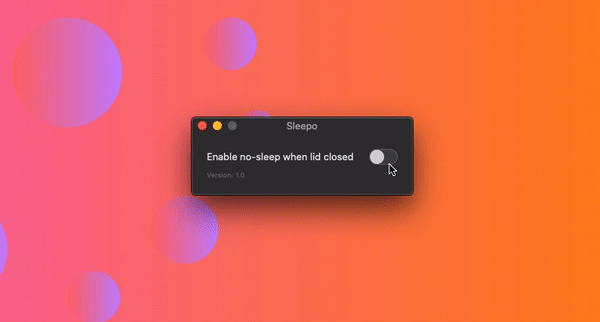

# Sleepo - NoMacLidSleep for MacBooks

## The problem and the solution
I am using a MacBook with an external monitor.
While it is connected I do not need the inbuild monitor.
But when closing the lid, the internal monitor turns off when the Mac is not connected to power.

To solve this issue, I created this AppleScript-based application - Sleepo.

## Important disclaimer
Be aware that this tool is quite powerful. 
**It overrides system values**.
You need to know that, if the tool is activated, your Mac cannot go intostandby.
So if you put your Mac in a closed bag **it cannot cool**.
This **can cause overheating or other damage**.

> THERE IS NO WARRANTY FOR THE PROGRAM, TO THE EXTENT PERMITTED BY APPLICABLE LAW. EXCEPT WHEN OTHERWISE STATED IN WRITING THE COPYRIGHT HOLDERS AND/OR OTHER PARTIES PROVIDE THE PROGRAM “AS IS” WITHOUT WARRANTY OF ANY KIND, EITHER EXPRESSED OR IMPLIED, INCLUDING, BUT NOT LIMITED TO, THE IMPLIED WARRANTIES OF MERCHANTABILITY AND FITNESS FOR A PARTICULAR PURPOSE. THE ENTIRE RISK AS TO THE QUALITY AND PERFORMANCE OF THE PROGRAM IS WITH YOU. SHOULD THE PROGRAM PROVE DEFECTIVE, YOU ASSUME THE COST OF ALL NECESSARY SERVICING, REPAIR OR CORRECTION.

## How is it working?
The technique behind Sleepo is quite simple: It manipulates the power management settings (`pmset`).
For this, it needs superuser (sudo)/administrator privileges.

## How to install

Currently, no direct download is available, due to Apples developer program fees.
But you can easily clone this repo and export Sleepo in Xcode: `Product -> Archive -> Distribute App -> Custom -> Copy App -> Select destination`.

Optional: Drag the app to your Applications folder and you are ready to go.

### User interface

> Currently no download is available. Just clone this repo and export Sleepo
in Xcode.

The user interface is the easiest way to manipulate `pmset`. Just start
Sleepo and (de)activate it with the switch. That's it!

### Terminal commands
> You use the commands at your own risk!

If you do not want do download Sleepo, you can directly manipulate `pmset`.
To stop your Mac goring into sleep when the lid is closed open your  `Terminal` and enter the following command:

> sudo pmset displaysleep 0

To reset `pmset` to its defaults just change the `0` to a `1`.

That's it! If you want to display the current settings type:

> sudo pmset -g

## Compatible MacBooks
Sleepo is compatible with all MacBooks which are running at least macOS 10.15.
